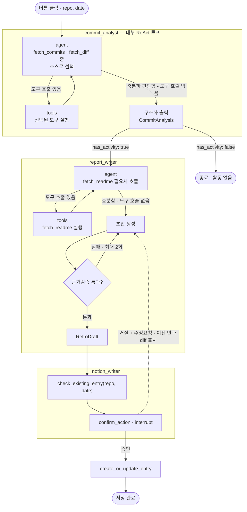

# dev-retro-agent

> **개발자 회고 에이전트** — 오늘 GitHub에 올린 커밋을 분석해서, 실제 근거에 기반한 회고를
> 자동으로 작성하고 노션에 정리해주는 멀티 에이전트 시스템

---

## 목차

- [핵심 아이디어](#핵심-아이디어)
- [사용 시나리오](#사용-시나리오)
- [아키텍처](#아키텍처)
  - [멀티 에이전트 구조](#멀티-에이전트-구조)
  - [에이전트별 역할·입출력](#에이전트별-역할입출력)
- [노션 저장 구조](#노션-저장-구조)
- [기술 스택](#기술-스택)
- [프로젝트 구조](#프로젝트-구조)
- [설치 및 실행](#설치-및-실행)
- [설계 결정](#설계-결정)
- [로드맵](#로드맵)

---

## 핵심 아이디어

개발자에게 그날 공부하고 개발한 내용을 회고 형식으로 정리하는 습관은 중요하지만, 매일 직접 쓰기는
번거롭습니다. 반면 **그날 무엇을 했는지에 대한 가장 정확한 기록은 이미 GitHub 커밋에 존재**합니다.

이 프로젝트는 그 커밋 기록을 근거 삼아 회고를 대신 작성합니다. 핵심은 **"오늘 실제로 한 일"과
"회고에 적힌 내용"이 반드시 일치하도록 검증**하는 것 — 안 한 일을 했다고 지어내면 안 되기 때문에,
생성된 회고는 항상 원본 커밋·코드 변경 내용에 근거했는지 확인을 거칩니다.

| 사람이 직접 하면 | 에이전트가 하면 |
|---|---|
| 그날 뭘 했는지 기억을 더듬어 회고를 씀 | 커밋·diff를 근거로 **실제로 한 일만** 회고에 반영 (근거검증) |
| 노션에 새 페이지를 만들지, 오늘 항목을 덮어쓸지 매번 확인 | 오늘 항목이 이미 있는지 확인 후 신규/갱신 판단 + 승인 요청 |
| 여러 레포를 각각 따로 기록 | 레포별로 구조화된 데이터베이스에 날짜순으로 정리 |

## 사용 시나리오

**A. 정상 흐름 — 오늘 활동이 있는 경우**

프론트엔드에서 레포를 선택하고 "오늘 회고 작성" 버튼 클릭
→ 커밋 분석(사소한 커밋은 메시지만, 의미 있는 변경은 diff까지 확인)
→ 회고 초안 생성 + 근거 검증
→ "이 내용으로 저장할까요?" 승인 요청
→ 승인 시 노션 데이터베이스에 저장, 링크 반환

**B. 활동이 없는 경우**

오늘 커밋이 하나도 없으면, 회고를 억지로 만들지 않고 "오늘은 기록할 활동이 없어요"로 즉시 종료합니다.

**C. 수정 요청이 있는 경우**

승인 대신 "이 부분 다르게 써줘"라고 응답하면, 회고를 다시 작성해 **이전 안과 달라진 점을 보여주고**
재승인을 요청합니다. 승인될 때까지 반복됩니다.

---

## 아키텍처

### 멀티 에이전트 구조



**핵심 설계 포인트 1 — 자율성은 "에이전트 내부"에만 두고, 에이전트 "사이" 순서는 고정한다**: 처음엔
"diff까지 볼 가치 있나"를 그래프의 조건부 엣지 하나로 표현했지만, 그러면 판단이 매 커밋마다 반복되지
못하고 전체에 대해 한 번만 갈리는 형식적 분기가 됩니다. 그래서 `commit_analyst` 자체를
`fetch_commits`·`fetch_diff`를 `bind_tools`한 **자기만의 `agent ⇄ tools` 루프(ReAct)**로 만들어,
커밋별로 "이건 메시지만, 이건 diff까지" 를 필요한 만큼 반복 판단하게 합니다. `report_writer`도
`fetch_readme` 호출 여부를 같은 방식의 루프로 스스로 정합니다. 반면 **에이전트 사이의 순서**
(분석 → 작성 → 저장)는 고정된 그래프 엣지입니다 — 이 순서까지 LLM이 매번 판단하게 하면(완전 동적
멀티에이전트) 실행이 불안정해지고, 반대로 각 에이전트 내부까지 고정 로직이면 "에이전트"라 부르기
어려워집니다. 자율성의 경계를 **"에이전트 내부의 tool-calling 루프"** 로 긋고, 그 바깥(오케스트레이션)은
설계자가 고정한다는 원칙입니다.

**핵심 설계 포인트 1-1 — ReAct 루프와 도구 실행의 결과는 구조화 출력으로 변환한다**: 일반적인 ReAct
루프는 도구 호출이 끝나면 자유 텍스트로 답하고 종료하지만, 여기서는 다음 에이전트가 정해진 필드
(`CommitAnalysis`, `RetroDraft`)를 그대로 이어받아야 합니다. 그래서 루프가 종료된 시점(마지막 메시지에
도구 호출이 없음)에 구조화 출력(`with_structured_output`) 호출을 한 번 더 거쳐 Pydantic 모델로
정리하는 단계를 각 에이전트 말미에 둡니다.

**핵심 설계 포인트 1-2 — 근거검증(grounding check)은 도구 루프가 아니라 명시적 그래프 엣지로 남긴다**:
`report_writer`의 "초안 생성 → 근거검증 → 실패 시 재생성"은 ReAct로 흡수하지 않았습니다. ReAct는
"외부에서 무엇을 더 관찰할지"를 위한 패턴이고, 근거검증은 "이미 만든 결과물을 스스로 채점"하는 별개의
관심사이기 때문입니다 — 이전 CRAG의 `grade_hallucination` 패턴을 그대로 재사용해 명시적 리트라이
엣지로 표현합니다.

**핵심 설계 포인트 2 — 생성과 저장을 분리한다**: `report_writer`는 노션 API를 전혀 모르고, 텍스트만
만듭니다. `notion_writer`는 반대로 텍스트를 수정하는 능력이 없고, 저장 여부만 판단합니다. 수정
요청이 오면 `notion_writer`가 직접 고치는 게 아니라 `report_writer`로 되돌아가는 엣지로 처리합니다 —
"판단/생성 노드"와 "실행 노드"를 분리하는 원칙을 그대로 적용한 것입니다.

**핵심 설계 포인트 3 — "내일 할 일"은 넣지 않는다**: README만으로 프로젝트의 실제 우선순위·맥락을
파악하는 것은 위험한 추측입니다. 이 에이전트는 **이미 일어난 일을 검증된 형태로 서술**하는 것까지만
책임지고, 앞으로의 계획 예측은 스코프에서 제외했습니다.

### 에이전트별 역할·입출력

**`commit_analyst`** — 내부 `agent ⇄ tools` 루프 (ReAct)
- 도구: `fetch_commits(repo, date)`, `fetch_diff(commit_sha)` — 둘 다 `bind_tools`로 LLM에 위임,
  어떤 커밋의 diff까지 볼지·몇 번 호출할지는 에이전트가 스스로 반복 판단
- 루프 종료(도구 호출 없음) 후 구조화 출력으로 변환:
  ```python
  class CommitAnalysis(BaseModel):
      has_activity: bool       # 오늘 커밋이 있었는지 (분기 기준)
      commit_count: int
      summary: str              # 오늘 있었던 작업 서술
      key_changes: list[str]    # 주요 변경사항 목록
  ```

**`report_writer`** — 정보 수집은 ReAct 루프, 근거검증은 명시적 리트라이 엣지
- 도구: `fetch_readme(repo)` (배경 맥락 참고용 — 필요하다고 판단할 때만 호출)
- 입력: `CommitAnalysis`
- 내부: (루프) 필요시 `fetch_readme` 호출 → 초안 생성 → `key_changes`에 실제로 근거하는지 검증
  → 실패 시 최대 2회 재생성(그래프 엣지, 도구 루프 아님)
- 출력:
  ```python
  class RetroDraft(BaseModel):
      report: str        # 회고 본문
      grounded: bool       # 근거검증 통과 여부
  ```

**`notion_writer`**
- 도구: `check_existing_entry(repo, date)`, `create_or_update_entry(...)`
- 입력: `RetroDraft`
- 내부: 기존 항목 확인 → `confirm_action`(interrupt 기반 HITL) → 승인 시 저장, 거절 시 `report_writer`로 회귀
- 출력:
  ```python
  class WriteResult(BaseModel):
      status: Literal["saved", "updated", "pending_confirmation"]
      page_url: str | None
      is_new_entry: bool
  ```

---

## 노션 저장 구조

프리폼 페이지 트리(레포 페이지 → 날짜별 하위 페이지)가 아니라 **단일 데이터베이스**로 구성합니다.

| 레포명 (속성) | 날짜 (속성) | 회고 내용 |
|---|---|---|
| dev-retro-agent | 2026-07-27 | ... |
| dev-retro-agent | 2026-07-26 | ... |

프리폼 페이지 구조였다면 "오늘 항목이 이미 있는지"를 제목 문자열 비교로 확인해야 했겠지만(Notion
API가 페이지 제목만 검색 가능하다는 제약 때문), 속성 기반 데이터베이스는
`databases.query(filter: 레포명==X, 날짜==오늘)`로 **정확하게 필터링**할 수 있습니다. 벡터 인덱스나
증분 동기화 같은 별도 검색 인프라가 필요 없습니다 — 이 프로젝트가 다루는 데이터가 애초에 구조화된
성격(레포+날짜)이기 때문입니다.

---

## 기술 스택

| 분류 | 기술 | 선택 이유 |
|------|------|----------|
| 언어 | Python 3.13 | — |
| 프레임워크 | FastAPI | 비동기 지원, 자동 Swagger 문서화 |
| 오케스트레이션 | LangChain · LangGraph | 멀티 에이전트 그래프 + human-in-the-loop(`interrupt`) |
| LLM | Google Gemini 2.5 Flash | tool-calling 지원, instruction-following 우수, 무료 티어 제공 |
| 외부 연동 | GitHub API (`PyGithub`) | 커밋·diff·README 조회, 개인 액세스 토큰(PAT)으로 인증 |
| 외부 연동 | Notion API (`notion-client`) | 데이터베이스 조회·생성, 무료, rate limit 3 req/s |
| 모니터링 | LangSmith | 멀티 에이전트 실행 과정 자동 트레이싱 |
| 패키지 관리 | uv | 빠른 의존성 해석, `pyproject.toml` + `uv.lock` |

> **이전 버전(notion-assistant) 대비 의존성 감소**: 개인 노트 검색을 위한 벡터 임베딩
> (Qwen3-Embedding-0.6B, torch, sentence-transformers)이 더 이상 필요 없습니다. 이 프로젝트가
> 다루는 데이터(GitHub 커밋, 노션 DB 항목)는 전부 구조화된 조회로 처리 가능하기 때문입니다. 이는
> 배포 이미지 크기와 런타임 메모리 요구량도 함께 줄여줍니다.

---

## 프로젝트 구조

```
dev-retro-agent/
├── src/
│   ├── main.py
│   │
│   ├── router/
│   │   ├── agent_router.py       # 회고 생성 트리거 엔드포인트
│   │   └── github_router.py      # 레포 목록 조회·선택 (일반 API, 에이전트 아님)
│   │
│   ├── schemas/
│   │   ├── agent_schema.py
│   │   └── github_schema.py
│   │
│   ├── core/
│   │   ├── config.py
│   │   └── llm.py                # Gemini 인스턴스만 (임베딩 제거)
│   │
│   ├── graph/
│   │   ├── state.py              # RetroState (repo, date, commit_analysis, retro_draft, write_result)
│   │   ├── nodes/
│   │   │   ├── commit_analyst.py  # 내부에 agent⇄tools ReAct 서브그래프 포함
│   │   │   ├── report_writer.py   # fetch_readme만 ReAct, 근거검증은 명시적 엣지
│   │   │   ├── notion_writer.py
│   │   │   └── confirm.py        # interrupt 기반 HITL
│   │   └── graph.py               # 세 서브그래프를 고정 순서로 조립하는 최상위 그래프
│   │
│   ├── tools/
│   │   ├── fetch_commits.py
│   │   ├── fetch_diff.py
│   │   ├── fetch_readme.py
│   │   ├── check_existing_entry.py
│   │   └── create_or_update_entry.py
│   │
│   ├── services/
│   │   ├── github_client.py      # GitHub API 래핑
│   │   ├── notion_client.py      # Notion API 래핑
│   │   └── prompts.py
│   │
│   └── prompts/
│
└── frontend/                      # 레포 선택 + 회고 생성 버튼 (간단한 SPA)
```

---

## 설치 및 실행

### 1. 패키지 설치

```bash
uv sync
```

### 2. 환경변수 설정

```env
GOOGLE_API_KEY=your_google_api_key
GITHUB_TOKEN=your_github_personal_access_token
NOTION_API_KEY=your_notion_integration_token
NOTION_RETRO_DB_ID=your_database_id
```

### 3. 서버 실행

```bash
uv run uvicorn src.main:app --reload
```

- Swagger UI: `http://localhost:8000/docs`

---

## 설계 결정

<details>
<summary><b>왜 2개 도구가 아니라 멀티 에이전트인가</b></summary>

처음엔 `generate_daily_report` + `write_report` 2개 도구를 하나의 ReAct 루프가 호출하는 구조를
고려했습니다. 하지만 이 구조는 내부가 고정 순서 파이프라인이라 "정교한 워크플로우"이지 "멀티
에이전트"라 부르기 어려웠습니다. 그래서 각자 독립된 도구 접근과 판단 범위를 가진 `commit_analyst` /
`report_writer` / `notion_writer` 세 에이전트로 재설계했습니다. 다만 전체 무제한 자율성(에이전트가
전체 실행 순서까지 매번 판단)은 스코프 규율(완성도 우선)과 충돌하므로, 에이전트 **사이**의 순서는
고정하고 자율성은 각 에이전트 **내부**로만 한정했습니다.
</details>

<details>
<summary><b>왜 "diff를 볼지 말지"를 조건부 엣지가 아니라 에이전트 내부 ReAct 루프로 두는가</b></summary>

처음 설계에서는 이 판단이 그래프의 조건부 엣지 하나였습니다. 그런데 이러면 커밋이 여러 개일 때도
전체에 대해 한 번만 갈리는 형식적 분기가 되어, "각 커밋을 보고 판단한다"는 의도와 맞지 않았습니다.
그래서 `commit_analyst`를 `fetch_commits`·`fetch_diff`에 `bind_tools`한 자기만의 `agent ⇄ tools`
루프(ReAct)로 바꿔, 커밋별로 필요한 만큼 반복 판단하게 했습니다. 같은 이유로 `report_writer`의
`fetch_readme` 호출도 고정 호출이 아니라 루프 안에서 필요하다고 판단할 때만 호출합니다. 다만 판단
성격이 다른 "근거검증 재생성"(이미 만든 결과물을 스스로 채점)까지 이 루프에 욱여넣지는 않았습니다 —
ReAct는 "외부에서 무엇을 더 관찰할지"를 위한 패턴이라, 자기 채점은 기존 CRAG의 명시적 리트라이
엣지(`grade_hallucination` 패턴)로 남겨뒀습니다. 각 에이전트는 다음 노드에 고정 스키마
(`CommitAnalysis`, `RetroDraft`)를 넘겨야 하므로, 루프 종료 후 구조화 출력(`with_structured_output`)
으로 정리하는 단계가 추가로 필요합니다.
</details>

<details>
<summary><b>왜 "내일 할 일" 제안을 넣지 않는가</b></summary>

README만으로는 프로젝트의 실제 우선순위, 진행 중인 이슈, 팀 논의 맥락을 알 수 없습니다. 이 상태에서
"내일 할 일"을 생성하면 근거 없는 추측이 됩니다. 반면 회고(이미 일어난 일의 서술)는 커밋·diff라는
확실한 근거가 있어 검증이 가능합니다. 그래서 이 프로젝트는 "검증 가능한 것"까지만 책임지도록
스코프를 좁혔습니다.
</details>

<details>
<summary><b>왜 노션 저장을 프리폼 페이지가 아니라 데이터베이스로 하는가</b></summary>

Notion API의 `search` 엔드포인트는 페이지 제목만 검색합니다(본문 검색 불가). 프리폼 페이지 트리로
저장하면 "오늘 항목이 이미 있는지" 확인할 때 이 제약에 걸립니다. 반면 레포명·날짜를 정식 속성으로
갖는 데이터베이스는 `databases.query`로 정확한 필터링이 가능해 이 문제를 원천적으로 피합니다. 이
프로젝트가 다루는 데이터(레포+날짜)가 애초에 표 형태로 구조화하기 적합하다는 점도 이 선택을
뒷받침합니다.
</details>

<details>
<summary><b>왜 개인 액세스 토큰(PAT)이고 서비스화하지 않는가</b></summary>

GitHub·Notion 모두 개인/단일 워크스페이스 전용 인증(Internal Integration, PAT)을 사용합니다. 이
방식은 "혼자 쓰는 개인 자동화" 또는 "한 회사가 자기 워크스페이스에서 여러 직원과 함께 쓰는 사내
도구"에는 완전히 적합하지만, 여러 조직에 판매하는 멀티테넌트 서비스로는 확장할 수 없습니다(각
조직이 자기 계정으로 로그인해 권한을 위임하는 OAuth가 필요). 이 프로젝트는 의도적으로 전자로
스코프를 잡았고, 서비스화가 필요해지면 인증 계층만 OAuth로 교체하면 되는 구조입니다.
</details>

---

## 로드맵

- [ ] `commit_analyst` — GitHub API 연동, 커밋/diff 조회, 분석 판단 로직
- [ ] `report_writer` — 회고 생성 + 근거검증 파이프라인
- [ ] `notion_writer` — 노션 데이터베이스 연동, `confirm_action` 기반 승인+재수정 루프
- [ ] 레포 선택 화면 (프론트엔드 + `github_router` API)
- [ ] 배포 재정비 (임베딩 의존성 제거로 가벼워진 이미지 반영)
